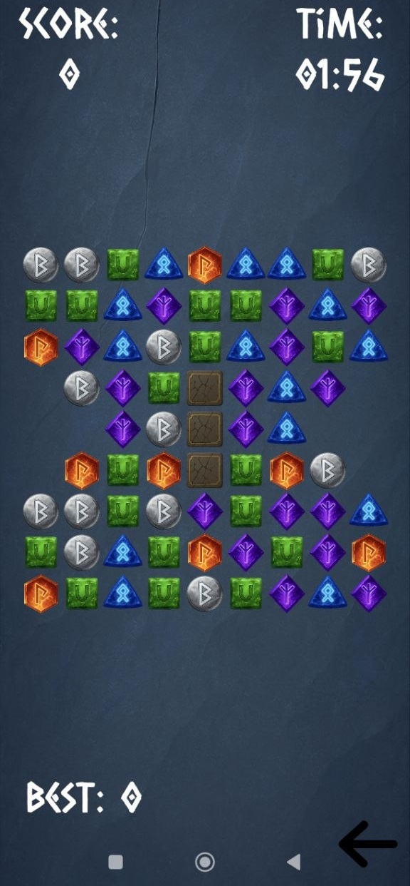
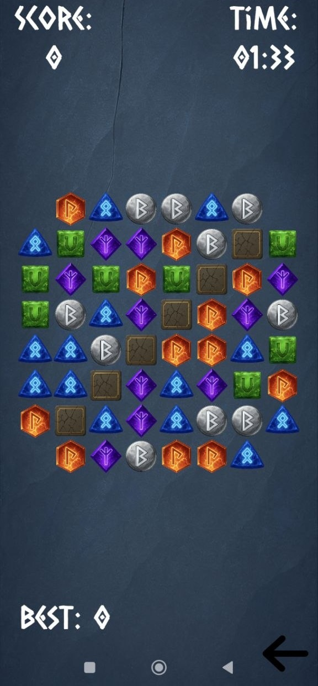
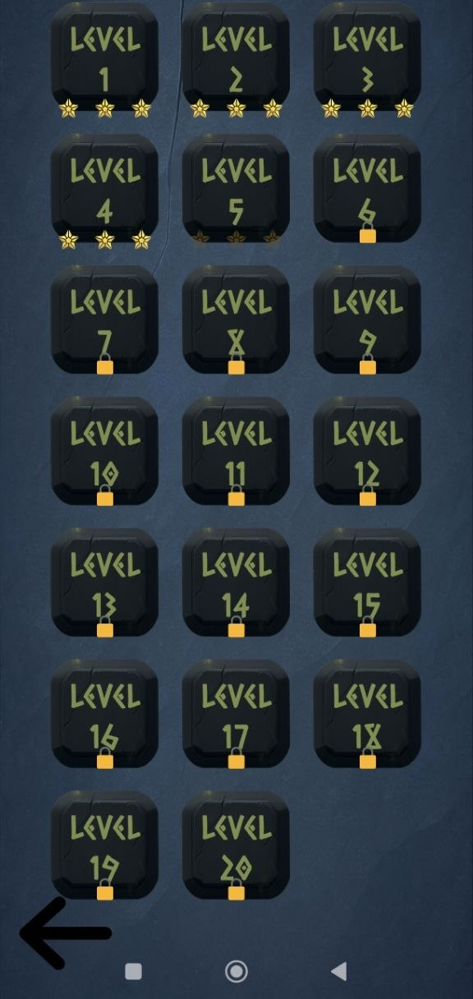
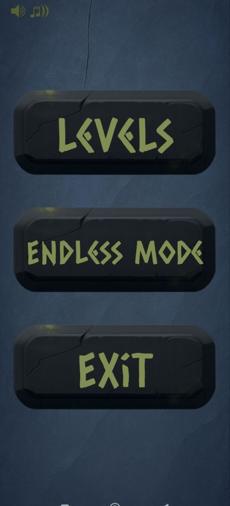

# Match-3 Puzzle Game

A robust, performant, and highly scalable Match-3 puzzle game built with Unity. The project demonstrates modern Unity development practices, clean architecture, and decoupled systems.

## Features

* **Clean Architecture:** Built using Dependency Injection (**Zenject**) for decoupled, testable, and maintainable code.
* **Event-Driven Communication:** Utilizes **SignalBus** for decoupled communication between UI, audio, and gameplay systems.
* **Optimized Performance:** Implements **Object Pooling** (`UnityEngine.Pool`) for gems, bombs, floating texts, and particle effects to eliminate garbage collection spikes during gameplay.
* **Asynchronous Gameplay Flow:** Uses `async/await` and **Tasks** (instead of Coroutines) combined with **DOTween** for smooth, sequential, and readable animation chains.
* **Dynamic Board Generation:** Features a grid auto-fitter and automatic board validation to ensure playable states with no dead-ends.
* **Ad Integration:** Built-in modular Unity Ads service implementation.

## Technologies Used

* **Engine:** Unity 2022.3
* **Language:** C#
* **DI Framework:** Extenject / Zenject
* **Animation:** DOTween (Demigiant)

## Gameplay Mechanics

* **Match Logic:** Swipe to match 3 or more identical gems.
* **Special Power-ups:** * Match 4 for Line Bombs (Vertical/Horizontal).
  * Match 5 or intersecting matches for Color Bombs.
* **Obstacles:** Breakable obstacles that take damage when adjacent matches occur.
* **Combo System:** Successive cascading matches reward multiplied score points.
* **Endless & Level Modes:** Supports predefined level data (ScriptableObjects) with specific targets, as well as an endless survival mode.

## Screenshots

<div align="center">
  
  
  
  
</div>

## Getting Started

### Prerequisites
* Unity Editor (Version 2022.3.62f3 or higher)
* [Zenject](https://github.com/modesttree/Zenject) framework installed in the project.
* [DOTween](http://dotween.demigiant.com/) installed in the project.

### Installation
1. Clone the repository:
   ```bash
   git clone [https://github.com/Endurigar/Match3-Puzzle-Core.git](https://github.com/Endurigar/Match3-Puzzle-Core.git)